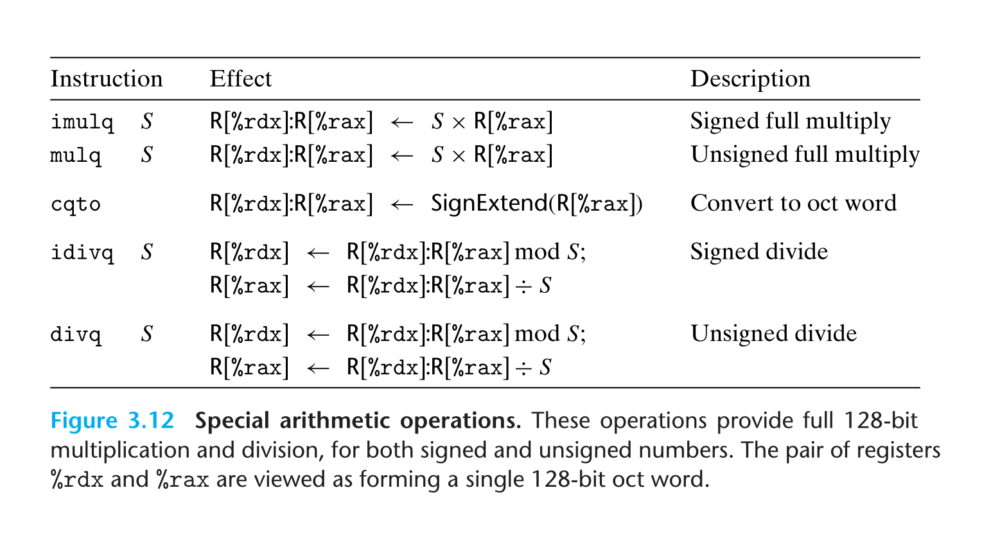

# Ch03—Machine-Level Representation of Programs

## Program Encodings

### Disassembler

```bash
objdump -d mstore.o
```

关于机器代码及其反汇编的特性：

1. `x86-64` 指令长度 1~15 字节不等。常用指令长度短
2. 反汇编器只是基于机器代码文件中的 **字节序列** 来确定汇编代码，它不需要访问该程序的源代码或汇编代码

### Notes on Formatting

- 所有以 **‘.’**开头的行都是指导汇编器和链接器工作的 **伪指令**

## Data Formats


## Accessing Information

### General-purpose Registers

一个 `x86-64` 的中央处理单元包含一组 16 个存储 64 位值的通用目的寄存器，用来存储整数数据和指针


对于生成小于 8 字节结果的指令，寄存器中剩下的字节会怎么样，对此有两条规则：

1. 生成 1 字节和 2 字节数字的指令会保持剩下的字节不变
2. **生成 4 字节数字的指令会把高位 4 个字节置为 0** （ `IA-32` 到 `x86-64` 的扩展，这样在 32 位机器也能跑）

### Operand Specifiers

#### Instruction: Operation code + Operands

- 大多数指令有一个或多个操作数（例外： `ret` 返回指令没有操作数）

- Operand：

  1. Immediate： `int` 的写法需要满足标准 C 定义

  2. Register：可以是通用寄存器的低位 1、2、4、8 字节

  3. **Memory Reference** ：

     引用数组元素时，会用到这种通用形式
     $$
     \begin{align}
        Imm(r_b, r_i, s) & \to \mathrm{Imm} + \mathrm{R[r_b]} + \mathrm{    [r_i]} \cdot s \\
        Imm & \to \mathrm{Immediate}(立即数) \\
        r_b & \to \mathrm{Base \, Register}(基址寄存器) \\
        r_i & \to \mathrm{Index \, Register}(变址寄存器) \\
        s & \to \mathrm{Scale \, Factor}(比例因子：1、2、4、8) \\
     \end{align}
     $$

  

### Data Movement Instructions

- 目的操作数不能是立即数
- 目的操作数和源操作数不能同时为内存引用

#### MOV 类


```assembly
# 五种可能组合，注意没有 Memory--Memory
movl $0x4050, %eax       # Immediate--Register, 4 bytes
movw %bp, %sp            # Register--Register,  2 bytes
movb (%rdi, %rcx), %al   # Memory--Register,    1 byte
movb $-17, (%esp)        # Immediate--Memory,   1 byte
movq %rax, -12(%rbp)     # Register--Memory,    8 bytes
```

**注意：**

- `movl` 指令以寄存器作为目的时，它会把该寄存器的高位 4 字节设置为 0
- `movq` 不能将 64 位立即数值作为源操作数，只能将 32 位补码立即数作为源操作数，然后符号扩展到 64 位，送到目的位置
- 要将任意 64 位 立即数作为源操作数，需要 `movabsq`

#### MOVZ 类


- 没有 `movzlq` ，因为 `movl` 已经干了这个活

#### MOVS 类


- `cltq` 没有操作数，它总是以寄存器 `%eax` 作为源， `%rax` 作为符号扩展结果的目的，效果与指令 `movslq %eax, %rax` 完全一致

### Pushing and Popping Stack Data


#### `pushq`

```assembly
pushq %rbp         # 将寄存器 %rbp 中储存的数据压入栈中，同时栈指针减 8
```

等价于

```assembly
subq $8, %rsp      # Decrement stack pointer
movq %rbp, (%rsp)  # Store %rbp on stack
```

#### `popq`

```assembly
popq %rax          # 从栈顶位置读出数据，然后将栈指针加 8
```

等价于

```assembly
movq (%rsp), %rax  # Read %rax from stack
addq $8, %rsp      # Increment stack pointer
```

## Arithmetic and Logical Operations


### Load Effective Address

#### `leaq`

加载有效地址

```assembly
leaq 7(%rdx, %rdx, 4), %rax    # 等价于 5x + 7
# 使用格式和 movq 相同，但实际上没有引用内存，只是计算 4 字数据本身
# 注意比例因子还是只能取值1、2、4、8
```

### Unary and Binary Operations

- 二元操作的第二个操作数不能是立即数

### Shift Operations

- 移位操作的操作数可以是立即数或者 **单字节寄存器 `%cl` 中的数值** （不能是其他寄存器）
- 对长为 $\omega $ 的数据操作时，移位量是由 `%cl` 寄存器的低位决定的，这里 $2^m = \omega $ ，高位会被忽略

### Special Arithmetic Operations



## Control
