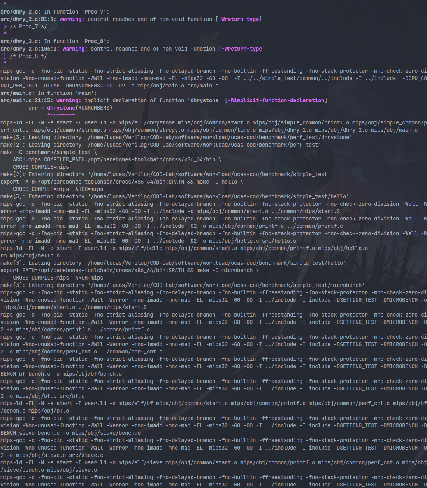
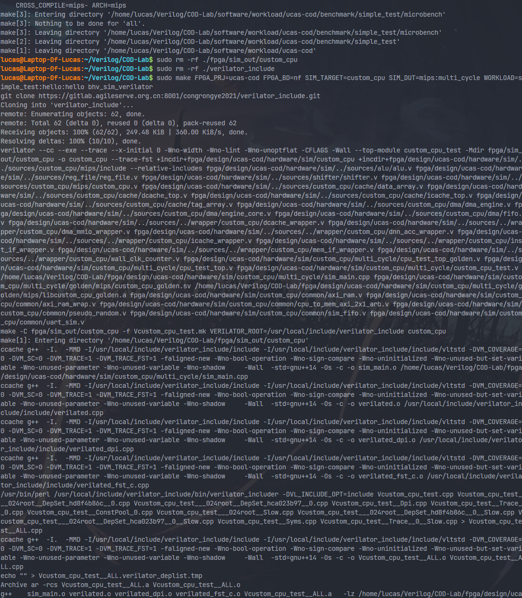

# cod-lab 本地仿真环境配置

经过亲身实践，本方法可以在 S-IDE 和 Ubuntu 22.04.4 LTS on Windows 10 x86_64 环境下成功进行软件编译和行为仿真。（其他 Linux 版本应该也可以......吧）

!!! note
    如果是在一个新环境下从零开始配置，需要重新设置好 git 的用户名和邮箱，配置 ssh key（不然没法拉取和上传自己仓库）并添加好实验框架的远程仓库（就是那个 `upstream` ），以及 IDE 的插件（详情参考张思老师的文档 [hello SERVE](https://gitlab.agileserve.org.cn:8001/zhangsi/hello-serve) ）

## verilator

在 [这里](https://github.com/verilator/verilator/releases/tag/v4.222) 下载 4.222 版本的 `verilator` 。


找一个目录（不要放到框架里，可以选择 `~` 主目录）本地解压即可，用以下命令解压：

```bash
tar -xvf verilator-4.222.tar.gz
```

然后移动至解压后的目录：

 ```bash
 cd verilator-4.222
 ```

依次执行以下命令:

首先安装必备的依赖：

```bash
sudo apt-get install git help2man perl python3 make autoconf g++ flex bison ccache libgoogle-perftools-dev numactl perl-doc zlib1g-dev
```

生成配置脚本：

```bash
autoconf && ./configure
```

编译安装：

!!! warning
    下面这两步会很漫长，如果在 S-IDE 上编译可能会花较长时间（我测试 S-IDE 的时候开了 16 G，也整了快半小时）。

```bash
make -j `nproc`
```

!!! note
    最新补充：如果上一条指令不能成功执行，可以直接改用 `make` ，不加任何参数（后来了解到 `-j` 参数作用是利用多个处理器核心加速优化，但是在 S-IDE 上反而会出现因内存占用过大被操作系统杀死进程的情况，稳妥起见还是用 `make` 吧）

最后输入下面指令，即可完成 `mips-gcc` 的最终安装步骤：

```bash
sudo make install
```

在终端输入以下指令，检查是否安装成功：

```bash
verilator --version
```

!!! success
    如果终端打印出 `Verilator 4.222 2022-05-02 rev UNKNOWN.REV` 字样，表示 `verilator` 本地配置成功。

## mips-gcc

!!! note
    S-IDE 可跳过此部分，因为 S-IDE 的 mips-gcc 就是实验框架的版本，无需重新设置

依次执行以下命令

```bash
cd && git clone https://github.com/rm-hull/barebones-toolchain.git
```

```bash
echo 'export PATH=$PATH:~/barebones-toolchain/cross/x86_64/bin' >> ~/.bashrc
source ~/.bashrc
```

在终端输入以下指令，检查是否安装成功：

```bash
verilator --version
```

!!! success
    如果终端打印出以下类似字样，表示 `mips-gcc` 本地配置成功。
    ```bash
    mips-gcc (GCC) 6.2.0
    Copyright (C) 2016 Free Software Foundation, Inc.
    This is free software; see the source for copying conditions.  There is NO
    warranty; not even for MERCHANTABILITY or FITNESS FOR A PARTICULAR PURPOSE.
    ```

## 进行软件编译和行为仿真（以 `hello` 为例）

!!! warning
    记得用 `git pull upstream master` 同步框架！！！

### 软件编译

软件编译输入：

```bash
make FPGA_PRJ=ucas-cod FPGA_BD=nf OS=phy_os ARCH=mips workload
```

<!-- !!! tip
    没错它就是这么长 -->

<!-- 

 -->


!!! success
    成功编译软件！！！

### 硬件行为仿真

先删掉先前仿真生成的多余文件：

!!! warning
    记得每一次仿真前都先把 `fpga/sim_out/custom_cpu` 和 `verilator_include` 删干净！！！

```bash
sudo rm -rf ./fpga/sim_out/custom_cpu ./verilator_include
```

下面输入仿真的命令（以 hello 为例）：

!!! warning
    记得 `make` 前要加 `sudo`

```bash
sudo make FPGA_PRJ=ucas-cod FPGA_BD=nf SIM_TARGET=custom_cpu SIM_DUT=mips:multi_cycle WORKLOAD=simple_test:hello:hello bhv_sim_verilator
```




!!! success
    成功完成行为仿真并在终端显示结果！！！

## 补充

懒人必备（一键仿真脚本）：

```shell
#!/usr/bin/sh

# 注意：仅适用于 prj3 ，其他实验项目可根据具体情况适当调整

# =====================================================================
#
#   使用方法：
#
#   1. 把本脚本放在 cod-lab 目录下，命名为 sim.sh
#   2. 命令行输入：  chmod 755 sim.sh  # 赋予脚本执行权限，只用做一次
#   3. 之后仿真时直接运行（注意加上sudo），例如：sudo ./sim.sh microbench fib
#
# =====================================================================


# =====================================================================
#
#   规则：方便查看（来自 .gitlab-ci.yml ）
#
#   - SIM_SET: basic
#     BENCH: [memcpy]
#   - SIM_SET: medium
#     BENCH: [sum,mov-c,fib,add,if-else,pascal,quick-sort,select-sort,max,min3,switch,bubble-sort]
#   - SIM_SET: advanced
#     BENCH: [shuixianhua,sub-longlong,bit,recursion,fact,add-longlong,shift,wanshu,goldbach,leap-year,prime,mul-longlong,load-store,to-lower-case,movsx,matrix-mul,unalign]
#   - SIM_SET: hello
#     BENCH: [hello]
#   - SIM_SET: microbench
#     BENCH: [fib,md5,qsort,queen,sieve,ssort]
#
# =====================================================================


SIM_SET=$1
BENCH=$2

TARGET_DESIGN="custom_cpu"
CPU_ISA="mips"
SIM_DUT_TYPE="multi_cycle"


# {====================================================================
# 确保参数合法
# =====================================================================

if [ $# -ne 2 ]; then
    echo "Usage: $0 [SIM_SET] [BENCH]"
    exit 1
fi


check_basic() {
    if [ $BENCH != "memcpy" ]; then
        echo "Error: [$BENCH] is not in the [$SIM_SET]"
        exit 1
    fi
}

check_medium() {
    case "$BENCH" in
    "sum"|"mov-c"|"fib"|"add"|"if-else"|"pascal"|"quick-sort"|"select-sort"|"max"|"min3"|"switch"|"bubble-sort")
        ;;
    *)
        echo "Error: [$BENCH] is not in the [$SIM_SET]"
        exit 1
        ;;
    esac
}

check_advanced() {
    case "$BENCH" in
    "shuixianhua"|"sub-longlong"|"bit"|"recursion"|"fact"|"add-longlong"|"shift"|"wanshu"|"goldbach"|"leap-year"|"prime"|"mul-longlong"|"load-store"|"to-lower-case"|"movsx"|"matrix-mul"|"unalign")
        ;;
    *)
        echo "Error: [$BENCH] is not in the [$SIM_SET]"
        exit 1
        ;;
    esac
}

check_hello() {
    if [ $BENCH != "hello" ]; then
        echo "Error: [$BENCH] is not in the [$SIM_SET]"
        exit 1
    fi
}

check_microbench() {
    case "$BENCH" in
    "fib"|"md5"|"qsort"|"queen"|"sieve"|"ssort")
        ;;
    *)
        echo "Error: [$BENCH] is not in the [$SIM_SET]"
        exit 1
        ;;
    esac
}


case "$SIM_SET" in
"basic")
    check_basic
    ;;
"medium")
    check_medium
    ;;
"advanced")
    check_advanced
    ;;
"hello")
    check_hello
    ;;
"microbench")
    check_microbench
    ;;
esac

# }====================================================================


# 删除上次仿真生成的一些可能产生冲突的文件
rm -rf ./fpga/sim_out/$TARGET_DESIGN ./verilator_include

# 软件编译
make FPGA_PRJ=ucas-cod FPGA_BD=nf OS=phy_os ARCH=mips workload

# 行为仿真
make FPGA_PRJ=ucas-cod \
     FPGA_BD=nf \
     SIM_TARGET=$TARGET_DESIGN \
     SIM_DUT=$CPU_ISA:$SIM_DUT_TYPE \
     WORKLOAD=simple_test:$SIM_SET:$BENCH \
     bhv_sim_verilator
```
